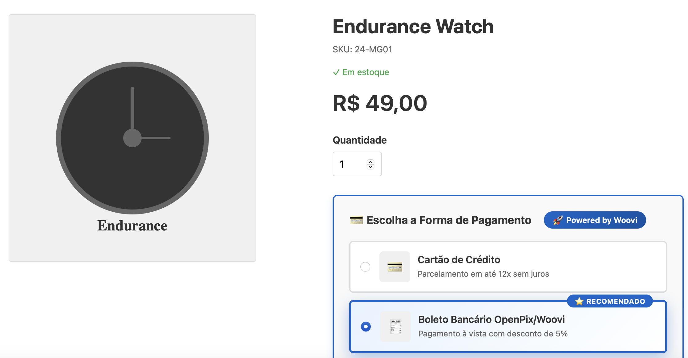
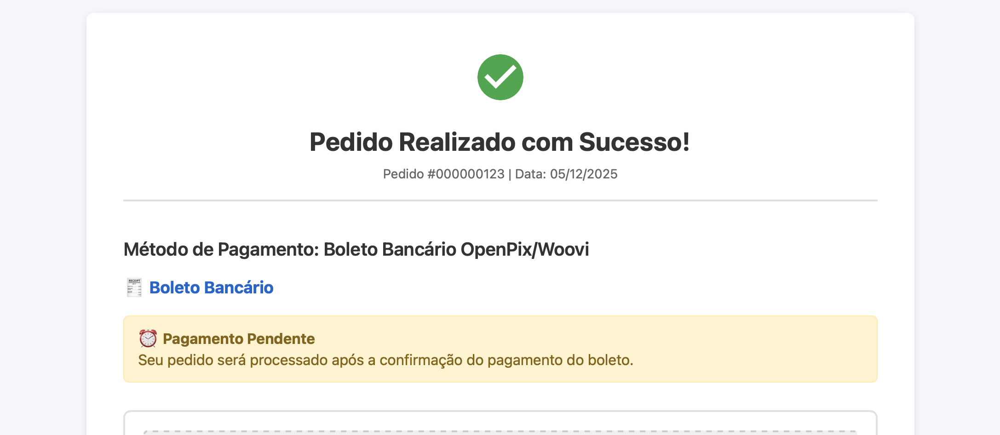

## OpenPix for Magento2
OpenPix Magento2 Pix plugin.

Follow the docs on [OpenPix - Magento2 Docs](https://entria.github.io/dev-docs/docs/openpix/openpix-magento2)



## Features

- Multiple payment methods: PIX, PIX Parcelado (Installments), and Boleto
- Fast and secure payment processing with OpenPix/Woovi
- Mobile-friendly checkout experience
- Automatic webhook notifications for payment updates
- Payment confirmation in real-time
- Support for multiple delivery addresses

## Available Payment Methods

The plugin provides three payment methods:

1. **PIX** (`openpix_pix`) - Instant payment via PIX QR Code
2. **PIX Parcelado** (`openpix_pix_parcelado`) - Installment payments via PIX
3. **Boleto Bancário** (`openpix_boleto`) - Bank slip payment with barcode



## Requirements

Minimum requirements to run this module and developer tooling:

- PHP: >= 7.0 (the code uses scalar type hints, return types and null coalescing). Practical recommendation: use the PHP version required by your Magento installation. For Magento 2.4.x this is typically PHP 7.4; newer Magento releases may require PHP 8.x.
- PHP extensions: OpenSSL extension must be available (the webhook controller uses openssl_verify for signature validation). The module also assumes common PHP extensions available for Magento (json, curl, mbstring, etc.) — follow your Magento installation requirements.
- Composer: required to install PHP packages and register the module into a Magento application.
- Node.js and package manager: Node.js (recommended >= 14, preferably 16+) and Yarn or npm are needed for running the repository scripts and tests (Jest) and building front-end assets.

Running tests

This repository uses Jest for the JavaScript tests. To run tests locally:

1. Install dependencies:

```bash
# with npm
npm install

# or with yarn
yarn install
```

2. Run the test suite:

```bash
yarn test
# or
npm test
```

Notes

- There are environment helper scripts in `package.json` that copy environment-specific configuration into `Pix/Helper/OpenPixConfig.php` (see `config:local`, `config:staging`, `config:prod`).
- The webhook endpoint expects the `x-webhook-signature` header and uses the public key configured in `Pix/Helper/OpenPixConfig.php` for verification.
- If you plan to run the existing TypeScript test that uses `sed` (currently skipped), be aware macOS `sed -i` differs from GNU sed — adapt or install GNU sed (`brew install gnu-sed`) or adjust the test to be cross-platform.

If you want, I can add a short Installation section showing how to enable the module in a Magento project and ensure DB schema attributes are created.
