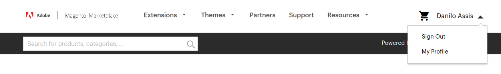
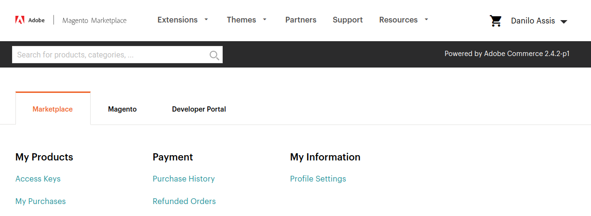
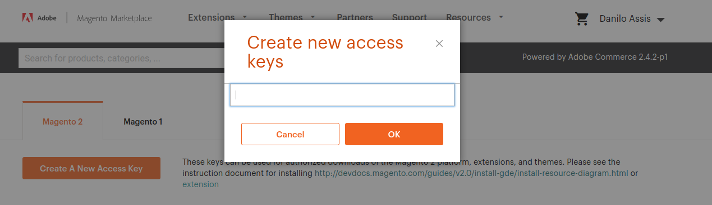

## OpenPix for Magento2
OpenPix Magento2 Pix plugin.

# Table of Content1.
- [1. Installing the Magento2 Store](#installing-the-magento2-store) - if is your first time running the plugin
    * [1.1 First step - creating magento account and access keys](#1-first-step---creating-magento-account-and-access-keys)
    * [1.2 Installing the Magento2 Store](#2-installing-the-magento2-store)
    * [1.3 Creating the Admin User](#3-creating-admin-user)
    * [1.4 Adding OpenPix Magento Plugin to your installation](#4-adding-openpix-magento-plugin-to-your-installation)
- [2. Local development already prepared](#local-development-already-prepared) - if your local environment is already done
    * [2.1 Start Stop](#startstop)
- [3. How to Develop and install the OpenPix plugin](#how-to-develop-and-install)
- [4. Common Errors](#common-errors)

## Installing the Magento2 Store
The best way to go forward with Magento2 local development is by [docker-magento](https://github.com/markshust/docker-magento).

### 1. First step - creating magento account and access keys
- go to Magento [Marketplace](https://marketplace.magento.com/) and sign in or create a new account
- Log in and go to https://marketplace.magento.com/customer/accessKeys/ by clickin in `MyProfile`
  

- Go to `Access Keys`
  

- create new access key and save both values: public and private
  

Once your keys is already created, stay with this tab opened on browser, go to install your local store. We will need these keys.

### 2. Installing the Magento2 Store
This is step is part of the **Automated Setup (New Project)** inside of [docker-magento](https://github.com/markshust/docker-magento). You can go there and do this step by their readme, or follow the steps below.

#### on terminal
- create a new empty folder and name as `magento2-openpix-store` or whatever you want.
- go to the root folder
- run `curl -s https://raw.githubusercontent.com/markshust/docker-magento/master/lib/onelinesetup | bash -s -- magento.test 2.4.2`
- note that `magento.test` will be your store local host.

- `Composer authentication required (repo.magento.com public and private keys):` - copy and paste the public key from magento marketplace
- `Password: ` - copy and paste the private key from magento marketplace

- it will install the magento store, update dependencies
- config the local store
- open in `magento.test` or the name you choose

### 3. Creating admin user
- on terminal run `bin/magento admin:user:create`
- fill information
- open `magento.test/admin` on browser and do the login

#### disable two factor authenticator
after creating the admin user it will be request the two factor authenticator. Disable it running this:

- on terminal at the root of project:
```ts
bin/magento module:disable Magento_TwoFactorAuth
bin/magento setup:upgrade
```

### 4. Adding OpenPix Magento Plugin to your installation
First, let clone the plugin inside of the root responsible for extensions on MagentoStore.

- for this step should be necessary give to your pc user the permission of the folder. To do this run:

```bash
sudo chown userName -R src/app/code
``` 

```bash
mkdir src/app/code/OpenPix
cd src/app/code/OpenPix
git clone https://github.com/Open-Pix/magento2-openpix.git
```

## Local development already prepared
Once the local development is already ok you can start to use the bin/magento CLI to run the application with OpenPix Magento2 PixPlugin.

### Start/Stop
- **bin/start** it will start all containers for your application
- **bin/stop** it will stop all containers for your application

## How to Develop and install
Sources to be helpful to this step:
- [openpix magento plugin #21321](https://github.com/entria/feedback-server/issues/21321) issue with docs Sources
- [docker commands gist](https://github.com/entria/feedback-server/issues/21321) helpful commands for docker
- [bin/magento commands gist](https://gist.github.com/daniloab/da0e4928ecc0aca5d71380b96425aff1) helpful commands for bin/magento cli

## Installing the plugin inside Magento2 store
- go to magento2 store src/
- inside of `src/app/code/` create a new folder with vendor name `Vendor` ex: OpenPix
- inside of `OpenPix` create other folder and name as module anme `ModuleName` ex: Pix

### Updating the Magento2 store after change
- make sure you store containers are running
- run `bin/magento setup:upgrade` to update it
- refresh your store to see the changes


## Common Errors

### Docker
When something go wrongs and is related to Docker, give a look below the possible reasons:

#### Is Docker running?
##### Arch Linux
- **sudo systemctl status docker** - status docker
- **sudo systemctl start docker**  - start docker
- **sudo systemctl stop docker**   - start docker

##### No access
On linux after install docker you need to run some other commands to make usable for your user:

### Port 80 is used by some process
You have something running on port 80 (this happens on mac osx)

Disable apache server

```bash
sudo apachectl stop
```

### Your Magento authentication keys are invalid
If you registered the wrong magento credentails, you can change then later on at ~/.composer/auth.json
