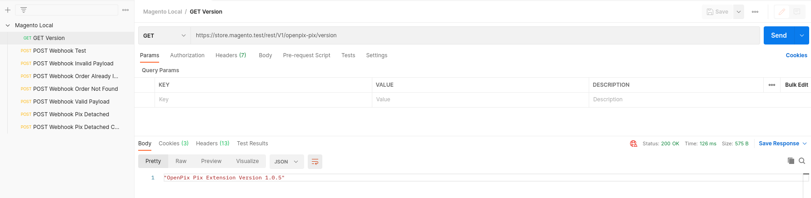
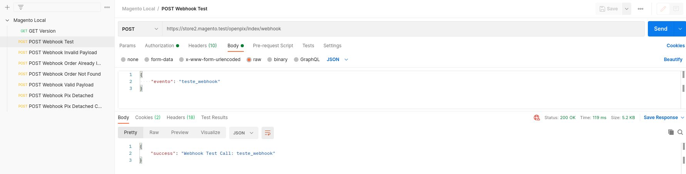
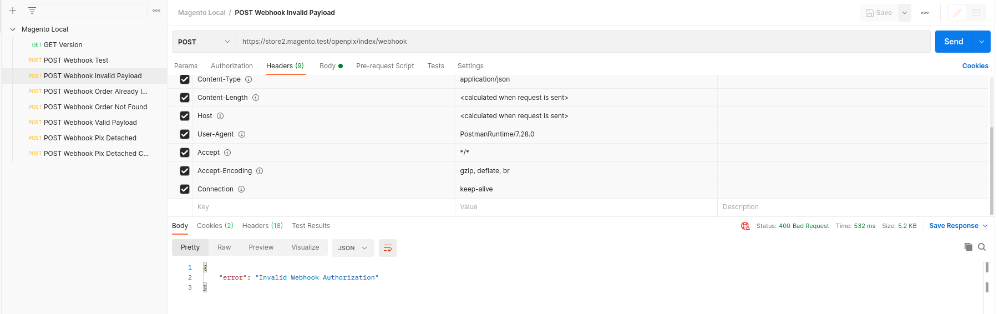
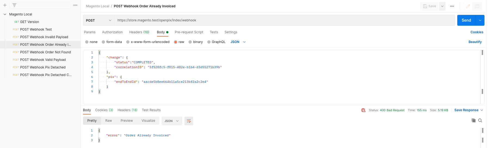
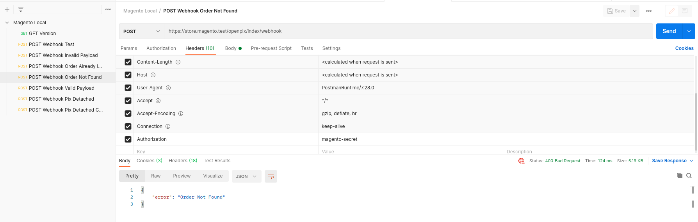
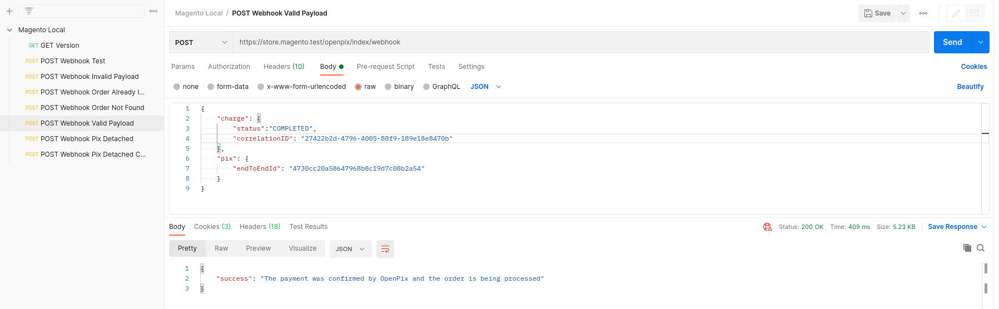
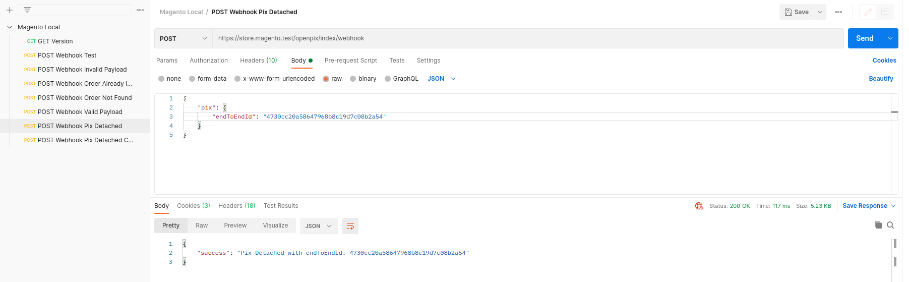
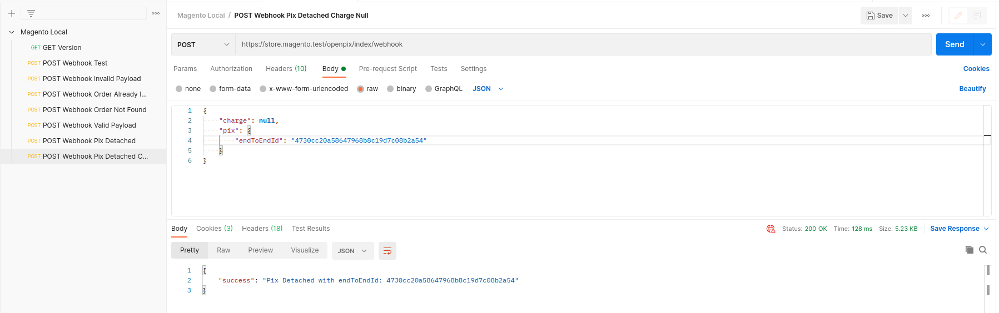
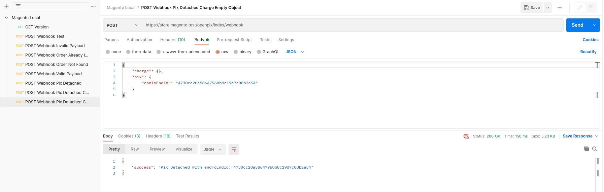

# Magento2 Endpoint Postman Tests
This postman json contains 8 requests testing the endpoints of OpenPix on magento2 store

- GET Version
  ;
  
- POST Webhook Test
  ;
  
- POST Webhook Invalid Payload
  ;
  
- POST Webhook Order Already Invoiced
  ;
  
- POST Webhook Order Not Found
  ;
  
- POST Webhook Valid Payload
  ;
  
- POST Webhook Pix Detached
  ;
  
- POST Webhook Pix Detached with Charge Null
  ;
  
- POST Webhook Pix Detached with Charge Empty Object
  ;

## Using
When use import `magento2-local-webhook-tests.postman_collection.json` into your postman and change some values:

- URL: should be your store URL
- Authorization: should be the Webhook Authorization registered in you Store
- BODY: only on valid payload endpoint you must have a valid value from an order in your store waiting to be paid

## Fix
When fixing some endpoint remember to generate a new Postman.json and update it here.